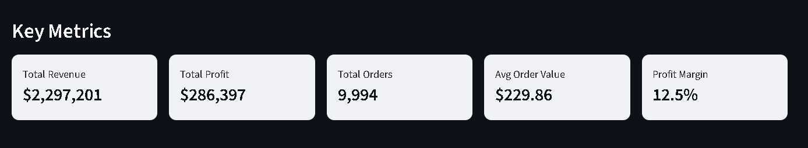

# AI-Powered Sales Forecast Simulator 📊

An intelligent business analytics platform that combines time series forecasting, Monte Carlo simulations, and machine learning to help businesses predict revenue, simulate scenarios, and make data-driven decisions.

This project demonstrates end-to-end data science skills, from data processing and ML model development to deploying a production-ready interactive application.

👉 **Live Demo:** https://sales-forecast-simulator-ffl9dmdytqya4x7fgj5mky.streamlit.app/ 

---

## 🎯 Project Motivation

This project was inspired by data visualization tools that make complex data easier to understand. I wanted to go beyond charts and build something that helps answer real business questions like:

- What will our sales look like in 6 months?
- What happens if we increase marketing spend by 30%?
- How much risk is built into this forecast?

The goal was to make enterprise-level forecasting accessible to everyone, including non-technical users, without requiring any coding knowledge.

---

## ✨ Key Features

### 1. Advanced Time Series Forecasting
- Uses Facebook Prophet for forecasts (1–24 months)
- Automatically captures trends, seasonality, and holidays
- Displays confidence intervals for uncertainty
- Adapts to different industries and business cycles


_Historical sales with forecasted trend and confidence intervals_

---

### 2. Interactive What-If Scenario Planning
Adjust scenarios in real time:
- Marketing spend (-50% to +100%)
- Seasonal campaign boosts (0% to +50%)
- Pricing adjustments (-30% to +30%)

- Instant visual feedback
- Side-by-side comparison of base vs scenario forecasts

![What-If Scenarios]
_What-If sliders and scenario comparison_

---

### 3. Monte Carlo Risk Analysis
- Runs 100–5,000 simulations
- Percentile outcomes (P10, P25, P50, P75, P90)
- Revenue distribution visualization
- Worst-case, most-likely, and best-case scenarios

![Monte Carlo Simulation]
_Monte Carlo simulation results_

---

### 4. Automated Anomaly Detection
- Z-score based statistical detection
- Flags unusual spikes and drops
- Adjustable sensitivity
- Helps catch data issues or unexpected market behavior

![Anomaly Detection]
_Anomaly alerts in sales data_

---

### 5. ML-Powered Feature Importance
- Random Forest model identifies revenue drivers
- Works with flexible dataset structures
- Supports numeric and categorical features
- Clear visual ranking of drivers

![Feature Importance]
_Feature importance bar chart_

---

### 6. Universal Data Support
- CSV, Excel, JSON, Parquet, TXT
- Automatic column detection
- Works with or without date columns
- Robust handling of missing or invalid data

---

### 7. Professional Reporting
- Export forecasts and scenarios to Excel
- Generate executive summary reports (TXT)
- Timestamped filenames for version control

![Export Options]
_Export buttons and sample reports_

---

## 🛠️ Technical Implementation

### Architecture
Data Input → Processing & Validation → ML Models → Interactive Dashboard → Reports


### Tech Stack

| Component | Technology | Purpose |
|--------|-----------|--------|
| Frontend | Streamlit | Interactive UI |
| Forecasting | Facebook Prophet | Time series modeling |
| Machine Learning | Scikit-learn (Random Forest) | Feature importance |
| Data Processing | Pandas, NumPy | ETL & transformations |
| Visualization | Plotly | Interactive charts |
| Statistics | Custom | Monte Carlo & anomaly detection |
| Export | OpenPyXL | Excel reports |

---

## 🔑 Key Algorithms

### Time Series Forecasting (Prophet)

```python
model = Prophet(
    yearly_seasonality=True,
    seasonality_mode="multiplicative",
    interval_width=0.95
)
```
- Decomposes trend and seasonality
- Handles missing data and outliers
- Produces uncertainty intervals

### Monte Carlo Simulation
```python
for iteration in range(num_simulations):
    random_factors = np.random.normal(1.0, uncertainty/100, periods)
    simulated_revenue = base_forecast * random_factors
```
- Models business volatility
- Generates probability distributions
- Quantifies forecast risk

## Anomaly Detection
```python
z_score = abs((value - rolling_mean) / rolling_std)
is_anomaly = z_score > threshold
```
- Flags unexpected deviations
- Sensitivity is configurable

## Feature Importance (Random Forest)
```python
rf = RandomForestRegressor(n_estimators=100, max_depth=10)
rf.fit(features, sales)
importance = rf.feature_importances_
```
- Handles non-linear relationships
- Works with mixed data types

# 📈 Use Cases
### Retail & E-Commerce
- Inventory planning
- Promotion testing
- Marketing spend optimization
- Sales anomaly detection

### SaaS & Subscriptions
- MRR forecasting
- Churn impact modeling
- Customer segmentation analysis

### Financial Planning
- Budget forecasting
- Risk scenarios for leadership
- Board-level reporting

### Marketing & Growth
- ROI modeling
- Pricing elasticity analysis
- Channel optimization

# 🚀 Getting Started
### Installation
```python
git clone https://github.com/nhlakaniphomdletshe/sales-forecast-simulator.git
cd sales-forecast-simulator

python -m venv venv
source venv/bin/activate  # Windows: venv\Scripts\activate

pip install -r requirements.txt
streamlit run app.py
```
# 🧪 Technical Challenges & Solutions
### Universal Data Compatibility
- Intelligent column detection
- Fallbacks for missing dates
- Robust validation and error handling

### Real-Time Performance
- Streamlit caching
- Cached models and simulations
- Sub-second response time

### Accessibility for Non-Technical Users
- Plain-language insights
- Sliders instead of configs
- No ML knowledge required

### Python Compatibility
- Version ranges in dependencies
- Tested on Python 3.9–3.13
- Verified on Streamlit Cloud

## 🔮 Future Enhancements
- Multiple forecasting models (ARIMA, LSTM, XGBoost)
- Ensemble forecasting
- SQL & Google Sheets integration
- PDF & PowerPoint exports
- User accounts and saved scenarios
- GPU acceleration for large datasets

